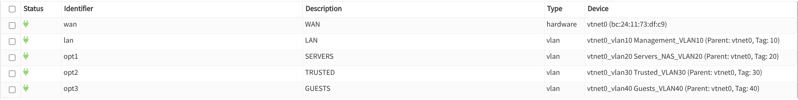
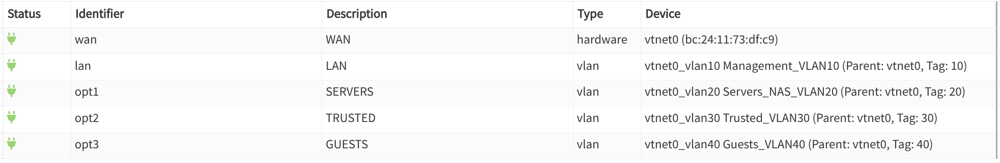

# Strutturazione rete

## VLAN

### Creazione dei tag  VLAN

Dividiamo la rete dell'homelab in sottoreti virtuali, questo consente di isolare la reti in più parti per renderla più sicura e manutenibile.

Per gestirle accedere a OPNsense > Interfaces > Devices > VLAN

Creando le seguenti sottoreti:
- VLAN 1 (Transit/WAN): rete casalinga del fritzbox, ospita l'host di Proxmox 
- VLAN 10 (Management): contiene dispositivi di infrastruttura di rete (router, switch, access point)
- VLAN 20 (Servers & Storage): contiene i servizi offerti dall homelab (nginx, jellyfin, immich, nas)
- VLAN 30 (Trusted): rete privilegiata che ospiterà future utenze esterne fidate.
- VLAN 40 (Users / Wifi): rete per i consumatori dei servizi offerti (wifi, utenze jellyfin, immich ecc..) 

### Assegnazione delle interfacce

Abbiamo appena creato i tag delle VLAN, ora dobbiamo trasformale in interfacce di rete gestibili

### Configurazione degli ip

Ora su OPNsense > Interfaces compariranno le nostre VLAN nel menu. Dovremo selezionarle per configurarle, assegnando un IPv4 che rappresenterà OPNsense su quelle VLAN. In questo modo ogni VLAN saprà che quell'indirizzo rappresenta il gateway.
Per ogni vlan selezioniamo
- enable interface
- IPv4 Configuration Tipe: Static IPv4
- IPv4 Address: l'indirizzo del gateway della VLAN (10.0.x.1)

### Creazione dei pool

Creiamo dei pool dhcp: un range di indirizzi che viene assegnato in automatico a nuovi dispositivi che si connettono alla rete.
Occorre accedere ad OPNsense > Services > Kea DHCP > Kea DHCPv4 > Subnets

+ Pool per VLAN30 (Trusted):
  - subnet: 10.0.30.0/24
  - 10.0.30.50 - 10.0.30.200

+ Pool per VLAN40 (Guests):
  - subnet: 10.0.40.0/24
  - 10.0.40.50 - 10.0.40.200

Salvare e **riavviare**.

## Configurazione firewall

Dobbiamo comunicare al firewal, che di default blocca tutto il traffico in entrata verso nuove interfacce, di garantire a queste reti la connessione internet.
Queste regole sono dei **Allow All** per le nostre VLAN:
- Action = Pass: indica al firewall cosa fare con il pacchetto dati. In alternativa si può bloccare o rigettare
- Protocol = Any: permettiamo traffico in UDP, TCP, ICMP ecc...
- Source * network: questa regola si attiverà solo se i dati saranno provenienti dalla rete * (nel nostro caso le VLAN)
- Destination = Any: permettiamo a questa rete di raggiungere qualsiasi punto di internet. 

Questa impostazione permissiva è utile su un setup iniziale.

Per creare nuove regole navigare su OPNsense > Rules > +.

### Regola per TRUSTED (VLAN 30)

Impostare:

- Action: Pass
- Protocol: Any
- Source: Trusted network
- Destination: Any

### Regola per GUESTS (VLAN 40)

Impostare:

- Action: Pass
- Protocol: Any
- Source: Guests network
- Destination: Any

