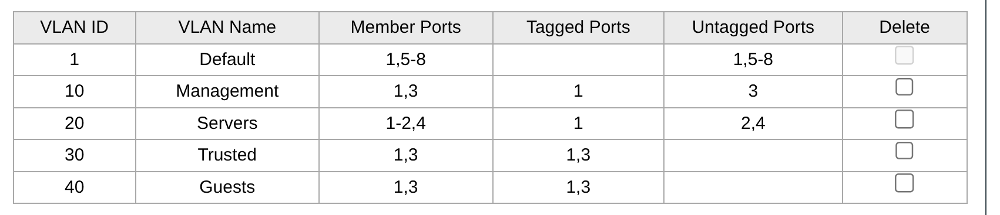

# Configurazione Switch

## Summary

1: Proxmox
2: NAS D-Link (vecchio)
3: Access Point MikroTik (Soggiorno)
4: NAS Synology (nuovo)
5: Access Point MikroTik (Camere)
6: -
7: -
8: Accesso alla rete (Uplink verso Fritzbox)

## Descrizione

- Porta 1: deve far passare tutto il traffico etichettato (Tagged) delle nuove VLAN, facendolo arrivare a OPNsense
- Porte 2 e 4: Untagged, connesse a devices di storage (NAS)
- Porte 3 e 5: ibride 
  - mantengono la VLAN 1 Untagged per la gestione (interfacciandosi direttamente con la rete base del Fritzbox)
  - VLAN 30 e 40 Tagged per la gestione degli SSID multipli (Trusted e Guest)

## Configurazione delle porte



## Fase in uscita: tabella 802.1Q

Questa tabella indica come lo switch debba comportarsi quando un pacchetto ha un'etichetta VLAN e deve farlo uscire da una porta fisica verso un dispositivo.

### Nozioni varie

1. Impostare una porta come Not Member di una VLAN significa che:
    - In uscita: mi assicuro che lo switch non invii mai un pacchetto con VLAN X la cui porta è Not Member di questa VLAN. Questo significa isolare dal traffico esterno un dispositivo.
    - In entrata: se qualcuno si collega alla porta dei NAS usando un PC configurato per inviare pacchetti con la VLAN 10 (per comunicare sulla sezione critica di management), lo switch lo rigetta perchè quella porta è Not Member della VLAN 10.
2. Una porta deve essere Untagged su una sola VLAN per volta per due motivi:
    - ne devo tenere solo una untagged così so che i pacchetti non taggati provengono da quella VLAN sicuramente. In caso contrario non saprei da quale VLAN vengono.
    - siccome una porta ha un solo PVID allora non potrei gestire due VLAN untagged perchè dovrei usarne solo una delle due, dunque tutti i pacchetti in uscita andrebbero solamente in una VLAN.
3. Impostare una porta come Untagged di una VLAN significa che:
    - se il dispositivo è un Endpoint (PC o NAS), questo non capisce di rete, gli interessa ricevere il pacchetto non taggato.
    - se il dispositivo è un Access Point: solitamente è Untagged dalla VLAN di management (come è in questo caso sulla VLAN 1 per i MikroTik) perchè sta ricevendo un pacchetto dal punto di gestione ed è l'Access Point stesso il ricevitore finale, non lo deve inoltrare sulle reti wifi taggate. Inoltre se su questa VLAN fosse tagged, il MikroTik andrebbe configurato per saper "spacchettare" pacchetti taggati.

### Porta 1
- Tagged su 10,20,30,40: Proxmox e OPNsense sono dispositivi di rete intelligenti -> sul singolo cavo passano 4 reti diverse per macchine virtuali diverse
- Untagged su 1: Proxmox ha IP sulla rete WAN casalinga (192.168.1.10), quindi se invio pacchetti senza etichetta dalla rete casalinga, lui risponde senza etichetta. Questo garantisce di non rimanere chiuso fuori dall'homelab in caso di problemi con OPNsense.

Nota: se la VLAN 1 fosse taggata, lo switch prenderebbe i pacchetti dalla rete WAN e ci incollerebbe il VID=1.
Questo pacchetto verrebbe rifiutato da proxmox per le configurazioni presenti in `/etc/network/interfaces` (indicano come IP=192.168.1.10) poichè non ha nessuna interfaccia virtuale configurata per rispondervi.
Ora si è stati "tagliati fuori" e non si ha più accesso all'interfaccia web sulla porta 8006.

### Porte 2 e 4
- Untagged su 20: i NAS sono dispositivi stupidi a livello di rete, non producono tag VLAN in entrata. In questo modo lo switch toglie il tag che il dispositivo non riuscirebbe a tradurre.
- Not member sulle altre: isoliamo i due NAS sulla VLAN 20, in questo modo se un dispositivo di un'altra VLAN prova a comunicare con questi NAS il pacchetto viene bloccato. L'unico modo per accedervi è passare per il gateway di OPNsense e verificare le regole del firewall.

### Porte 3 e 5 (Access Point MikroTik)
- Not member su 10 e 20: gli access point non c'entrano né con i server né con la rete manageriale di OPNsense (VLAN 10), avendo ora gli IP di gestione sulla rete base. In particolare sono Not Member sulla VLAN 20 perchè un utente connesso al wifi non deve poter vedere i NAS bypassando eventuali regole del firewall. Un motivo secondario è di performance: i messaggi broadcast viaggiano all'interno di una VLAN, se includo questa VLAN nelle porte degli AP i dispositivi collegati al wifi dovrebbero ascoltare i messaggi broadcast dei NAS senza alcun motivo, intasando la banda e consumando la batteria.
- Untagged su 1: il destinatario ultimo per la gestione è lui (arrivando dalla rete base 192.168.1.x del Fritzbox) e non sa spacchettare i tag per la propria interfaccia di amministrazione.
- Tagged su 30 e 40: li mettiamo tagged per gestire le reti wifi multiple (Trusted e Guest): quando l'access point riceve i pacchetti tagged dallo switch, usa il tag per sapere su quale rete wifi trasmetterlo.

### Porta 8
- Untagged su 1: il router FritzBox non sa spacchettare i tag, deve ricevere pacchetti untagged e invia pacchetti non taggati.
- Not member su 10,20,30,40: il router della WAN non gestisce le sottoreti dell'homelab e non deve conoscere di conseguenza le VLAN. Inoltre i pacchetti interni non devono mai finire su internet per errore, ma devono passare per forza per il firewall di OPNsense.

## Fase in ingresso: PVID

Dobbiamo configurare che cosa deve succedere quando una porta riceve un pacchetto in ingresso da un dispositivo. Serve per taggare un pacchetto in entrata che ne è sprovvisto.

|PORT|PVID|
|----|----|
|Port 1|1|
|Port 2|20|
|Port 3|1|
|Port 4|20|
|Port 5|1|
|Port 6|1|
|Port 7|1|
|Port 8|1|


# Aggiornamento infrastruttura

Ora che abbiamo configurato correttamente le VLAN occorre aggiornare Proxmox affinchè tutto funzioni.

1. Preparazione infrastruttura: è necessario assicurarsi che Hypervisor e Firewall comunichino correttamente
    - Disabilitare Hardware Offloading su OPNsense -> evita che i driver virtuali VirtIO rimuovano le etichette 802.1Q dai pacchetti in transito
    - Configurazione Trunk Proxmox: modificare il file `/etc/pve/qemu-server/101.conf` aggiungendo i tag consentiti alla scheda di rete: `net0: ...,bridge=vmbr0,trunks=10;20;30;40`. In questo modo il bridge VLAN-aware di Proxmox è istruito a far passare i pacchetti taggati verso OPNsense.
    - Eseguire shutdown + restart della VM di OPNsense
2. Migrazione servizi:
    - Modificare l'interfaccia di rete del servizio posizionandolo sulla VLAN desiderata e aggiornare il Gateway sulla stessa VLAN.
    - Eseguire shutdown + restart del servizio
3. Verifica:
    - ping a 10.0.20.1 -> verifica L2 verso gateway di OPNsense
    - ping a 8.8.8.8 -> verifica che esca su internet (funziona firewall, routing NAT, L3)

## Inserimento dei servizi nella VLAN 20

0. Spegnere la VM
1. Modificare il VLAN tag della VM da Hardware > Network > in VLAN tag selezionare 20
2. Accendere la VM e accedere al file di configurazione di rete con `/etc/network/interfaces` e modificare la primary network interface da dhcp in:
   
```bash
    iface ens18 inet static
        address 10.0.20.x/24
        gateway 10.0.20.1
        dns-nameservices 8.8.8.8 1.1.1.1