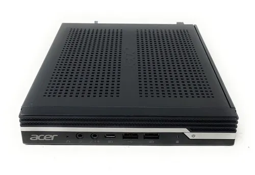
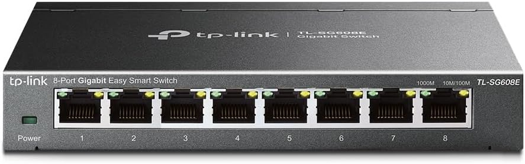
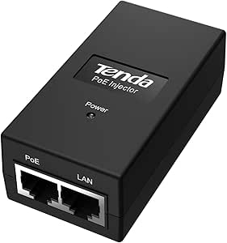
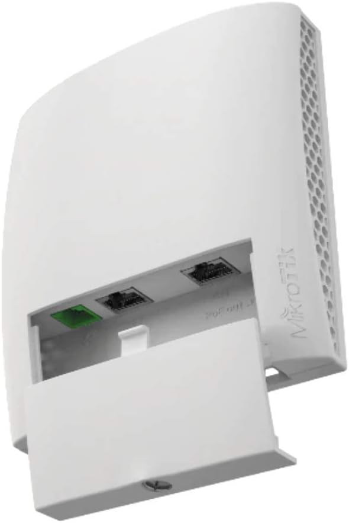

### Server Host

{ width="200" }

* **Model:** Acer Veriton N4660G (Mini PC Form Factor)
* **Hardware Specifications:**
* **CPU:** Intel Core i5-8500T (6 Cores, 6 Threads, 2.10 GHz base clock).
* **RAM:** 16 GB DDR4 @ 2667MHz (Configured in Symmetric Dual-Channel).
* **Storage:** 512 GB Toshiba M.2 NVMe PCIe SSD.
* **Bought for:** €160 (Refurbished).

### Managed Network Switch

{ width="200" }

* **Model:** TP-Link TL-SG608E (8-Port Gigabit Easy Smart Managed Switch)
* **Hardware Specifications:** 8x Gigabit (10/100/1000 Mbps) RJ45 ports, Layer 2 (L2) network features, durable metal chassis.
* **Bought for:** €27.99

### Power over Ethernet (PoE) Injector

{ width="200" }

* **Model:** Tenda POE15F
* **Hardware Specifications:** 48V PoE Adapter, Fast Ethernet (10/100 Mbps), IEEE 802.3af/u compliant, 15.4W maximum power output.
* **Bought for:** 10.74€

### Wi-Fi Access Point

{ width="200" }

* **Model:** MikroTik wsAP ac lite
* **Hardware Specifications:** Dual-Band (2.4 GHz and 5 GHz) wireless capabilities, Fast Ethernet (10/100 Mbps) ports, PoE-In support, powered by the RouterOS operating system.
* **Estimated Market Value:** ~€60 (New).

### Network Cabling (Patch Cables)

* **Model:** Cat6 Network Cables (0.25m, Black, 5-Piece Multipack)
* **Hardware Specifications:** Category 6, 250MHz bandwidth, Halogen-Free, compatible with Gigabit (1000 Mbit/s) and 10-Gigabit standards.
* **Bought for**: 9.95€