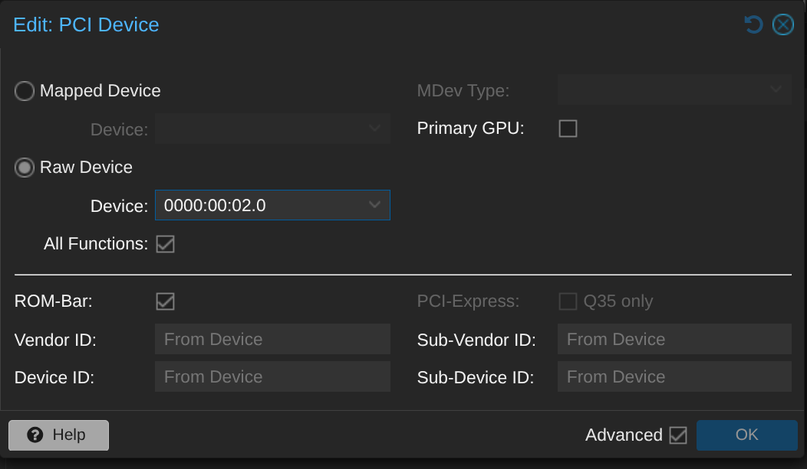

# Abilitare iommu su proxmox

Dalla console di proxmox
    nano /etc/default/grub

e mettere in GRUB_CMDLINE_LINUX_DEFAULT, "quiet intel_iommu=on iommu=pt"

salvare le modifiche lanciando
    update-grub

# Installare vm debian

Installare e configurare vm debian con spec:
- Cores: 4
- RAM: 4GB
- Storage: il NAS

Aggiungere ad hardware il PCI device affinchè la vm sfrutti la scheda grafica UHD graphics fornita dalla nostra cpu i-8500T.

# Predisporre ambiente per Jellyfin

Installare pacchetti necessari:
    apt update && apt install cifs-utils curl wget nano -y

Creare cartella per mount:
    mkdir -p /mnt/jellyfin_media

Aggiungere configurazione di connessione al vecchio NAS:
    //10.0.20.50/Volume_1 /mnt/jellyfin_media cifs guest,vers=1.0,iocharset=utf8,_netdev 0 0

Montare il NAS:
    mount -a

Verificare che il NAS sia stato montato correttamente:
    df -h

Installare docker
    curl -fsSL https://get.docker.com -o get-docker.sh && sh get-docker.sh

Preparare cartelle per jellyfin
    mkdir -p /opt/jellyfin && cd /opt/jellyfin

Creare file di configurazione docker per sbloccare la transcodifica hardware Intel Quick Sync:
    nano docker-compose.yml

    services:
        jellyfin:
            image: jellyfin/jellyfin:latest
            container_name: jellyfin
            network_mode: 'host'
            volumes:
            - ./config:/config
            - ./cache:/cache
            - /mnt/jellyfin_media:/media
            devices:
            - /dev/dri:/dev/dri
            restart: 'unless-stopped'

Avviare il conteiner docker con:
    docker compose up -d

# Accedere a Jellyfin

Accedere alla gui web tramite:
    ip_vm:8096

