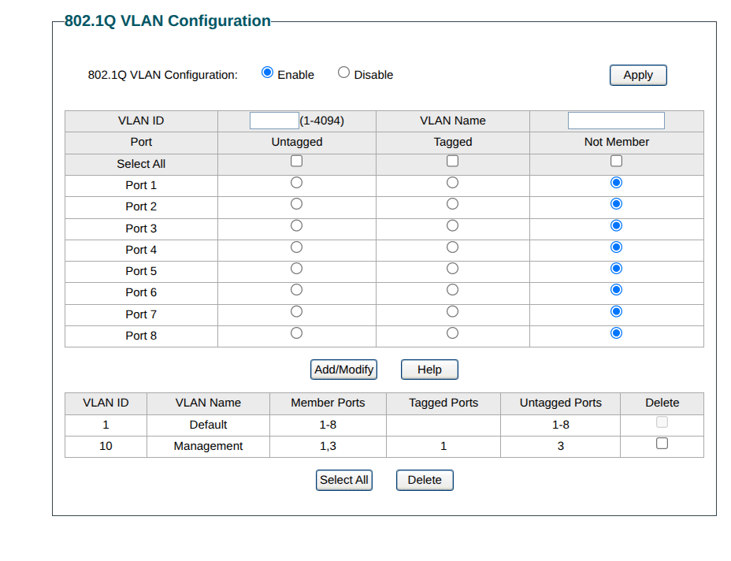
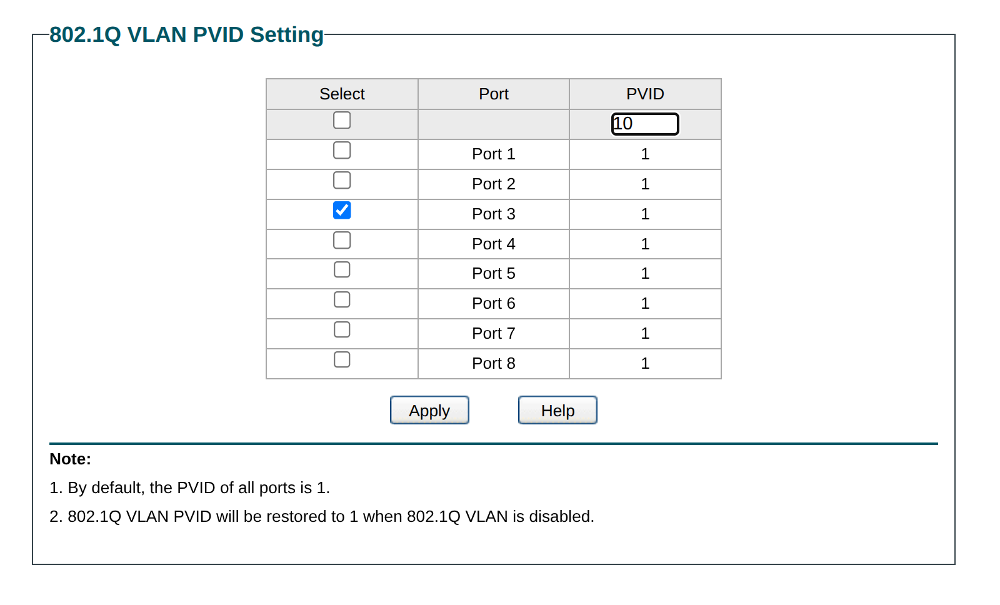

qui configuriamo dalla gui dello switch la vlan e mettiamo che porte devono essere trunk (tagged) e quali untagged stupide

qui si configura il pvid

fare config backup in caso lo switch si spwgnesse.

# Architettura router on a stick

## 1. Topologia e Concetti di Base

L'obiettivo di questo progetto è la creazione di un HomeLab isolato (VLAN 10) gestito da un firewall virtualizzato (OPNsense), accessibile fisicamente dall'amministratore solo tramite un Access Point Wi-Fi.

Questa architettura prende il nome di **Router on a Stick**. A differenza di un setup tradizionale dove un router ha più cavi fisici (uno per ogni rete), qui un singolo cavo fisico trasporta il traffico di più reti diverse simultaneamente. Per evitare che i pacchetti si mescolino, viene utilizzato il protocollo **IEEE 802.1Q**, che "etichetta" (Tag) ogni pacchetto ethernet con un numero identificativo.

**Inventario e Indirizzamento:**

* **VLAN 1 (Rete Domestica / Untagged):** `192.168.1.0/24`. Rete del router ISP (FritzBox) e interfaccia di management dell'Hypervisor (Proxmox IP: `192.168.1.10`).
* **VLAN 10 (Rete HomeLab / Tagged):** `10.0.10.0/24`. Rete gestita da OPNsense (IP: `10.0.10.1`).
* **Switch L2:** TP-Link Managed Switch.
* **Access Point L2:** MikroTik wsAP ac lite.
* **Client:** Portatile Ubuntu (connessione esclusivamente Wi-Fi).

---

## 2. Il Livello Fisico (Layer 1): Cablaggio e Alimentazione

Uno degli errori più insidiosi affrontati ha riguardato il cablaggio dell'Access Point. Inizialmente, il MikroTik riceveva corrente dalla Porta 1 (PoE IN) tramite l'iniettore, mentre i dati viaggiavano su un cavo separato collegato alla Porta 2.

**Il Passaggio Corretto:**

1. Il cavo proveniente dallo Switch (Porta 3) entra nella porta **LAN / Data IN** dell'iniettore PoE.
2. Un singolo cavo esce dalla porta **PoE / Data OUT** dell'iniettore ed entra nella **Porta 1 (PoE IN)** del MikroTik.

**Perché lo facciamo:** In dispositivi enterprise come i MikroTik, la porta 1 (`ether1`) è considerata l'interfaccia di uplink principale e, nelle configurazioni di fabbrica, è spesso l'unica ad avere permessi speciali o a essere pre-inserita in determinati bridge logici. Separare alimentazione e dati su due porte diverse complica inutilmente la topologia e rischia di far finire il traffico dati in una porta logicamente "morta" o isolata dal Wi-Fi. Un singolo cavo unifica il flusso di Layer 1.

---

## 3. Lo Switch L2 (Layer 2): Tagging e PVID

Lo switch è il vigile urbano della nostra rete. Deve smistare il traffico tra dispositivi che "parlano" le VLAN (Proxmox/OPNsense) e dispositivi che non le capiscono (il portatile connesso in Wi-Fi).

**Il Passaggio Corretto (Menu 802.1Q dello Switch):**

1. **Porta 1 (Verso Proxmox):** Impostata come **Tagged (T)** per la VLAN 10.
2. **Porta 3 (Verso MikroTik):** Impostata come **Untagged (U)** per la VLAN 10.
3. **Menu PVID (CRITICO):** Il PVID della Porta 3 deve essere forzato a **10**.

**Perché lo facciamo:**

* La **Porta 1 (Trunk)** lascia passare i pacchetti con l'etichetta intatta.
* La **Porta 3 (Access)** rimuove l'etichetta 10 quando invia i pacchetti verso il MikroTik (che è un dispositivo "stupido" e non deve vedere le etichette).
* Il **PVID (Port VLAN ID)** è il concetto più frainteso: serve a gestire il traffico *in ingresso*. Quando il tuo portatile invia un pacchetto Wi-Fi (Untagged), lo switch lo riceve nudo e crudo. Il PVID dice allo switch: *"Qualsiasi pacchetto senza etichetta che entra da questa porta, marchialo a fuoco con il Tag 10"*. Se il PVID fosse rimasto a 1, il traffico del laboratorio sarebbe stato instradato sulla rete domestica e distrutto.

---

## 4. L'Hypervisor (Proxmox): Il Bug del "Double-Tagging"

Questo è stato il blocco più ostico. OPNsense era configurato per gestire internamente il Tag 10, ma i pacchetti non arrivavano.

**Il Passaggio Corretto (Via CLI su Proxmox):**

1. Allineare la configurazione dell'host in `/etc/network/interfaces` aggiungendo:
* `bridge-vlan-aware yes`
* `bridge-ports nic0`

2. Forzare l'inserimento del Trunk sulla VM scavalcando la GUI:
* `qm set 101 --net0 virtio=MAC_ADDRESS,bridge=vmbr0,trunks=10`

3. Riavviare la VM (`qm reset 101`).

**Perché lo facciamo:** La GUI di Proxmox soffre spesso di "split-brain" tra backend e frontend. Se il file di testo non è perfettamente allineato, la GUI nasconde dinamicamente il campo "Trunks" dalle schede di rete virtuali per evitare errori.
Inoltre, in un setup *Router on a Stick*, non devi **mai** impostare il parametro "VLAN Tag" sulla scheda di rete della VM. Se lo fai, Proxmox (agendo da switch virtuale) rimuoverà l'etichetta 10 prima di consegnare il pacchetto a OPNsense. OPNsense, che ha l'interfaccia impostata su `vtnet0_vlan10` e si aspetta un pacchetto etichettato, scarterà il traffico "pulito" (fenomeno del Tag Stripping). Autorizzando il `trunks=10`, ordiniamo a Proxmox di fare da passacarte trasparente, preservando l'etichetta 802.1Q.

---

## 5. La "Lobotomia" dell'Access Point (MikroTik)

Un MikroTik nasce come router potente. Per usarlo come semplice Access Point (ponte radio), abbiamo dovuto annientare le sue funzioni di Livello 3 e disabilitare i protocolli di sicurezza di Livello 2, affrontando due problemi letali: l'STP e il Rogue DHCP.

**Il Passaggio Corretto (Via App MikroTik):**

1. **Creazione del Bridge:** Assicurarsi che nel menu *Bridge -> Ports* coesistano sia l'interfaccia fisica `ether1` (cavo) sia le interfacce wireless (`wlan1`, `wlan2`).
2. **Uccidere lo Spanning Tree Protocol (STP):** Nel menu principale del *Bridge -> STP*, impostare la modalità su **`none`**.
3. **Sopprimere il Rogue DHCP:** Nel menu *IP -> DHCP Server*, disabilitare o cancellare qualsiasi server DHCP attivo (tipicamente sulla rete 192.168.88.x).

**Perché lo facciamo:**

* **Il blocco STP (Forwarding: no):** Lo Spanning Tree Protocol è un sistema inventato per prevenire i loop di rete (quando gli switch formano un anello chiuso, causando tempeste di pacchetti che paralizzano la rete). Il MikroTik stava tenendo la porta `ether1` in uno stato di "blocco preventivo", temendo un loop. Essendo la nostra una topologia a linea retta, disattivare l'STP ha forzato la porta in stato di inoltro immediato (Forwarding: yes).
* **Il Rogue DHCP (Race Condition):** Il tuo telefono non riusciva a navigare perché, appena si collegava al Wi-Fi, il server DHCP nativo del MikroTik (192.168.88.x) gli offriva un IP prima che potesse farlo OPNsense (10.0.10.x). È una classica *Race Condition*: vince chi risponde più in fretta (ed essendo il MikroTik l'antenna fisica, vinceva sempre). Uccidendo il server ribelle, il telefono è stato obbligato ad attendere pazientemente l'IP fornito da OPNsense attraverso il tunnel VLAN.

---

## 6. Routing e Servizi (OPNsense)

Finalmente giunti a Livello 3, l'ultimo ostacolo riguardava la mancata distribuzione dei parametri vitali (Gateway e DNS) ai dispositivi client mobili tramite il nuovo motore Kea DHCP.

**Il Passaggio Corretto:**

1. **Configurazione Kea DHCP:** Andare in *Services -> Kea DHCP -> Subnets*. Aprire la sottorete `10.0.10.0/24`.
2. **Opzioni Esplicite:** Nel campo *Options*, forzare manualmente:
* `routers` -> `10.0.10.1` (Insegna ai client qual è la porta d'uscita).
* `domain-name-servers` -> `8.8.8.8` (o l'IP di OPNsense se si usa il resolver locale).

3. **Unbound DNS:** Se si sceglie di far risolvere i nomi a OPNsense, abilitare *Unbound DNS* (e assicurarsi che in *System -> Settings -> General* siano presenti i DNS globali come 8.8.8.8 per permettere a OPNsense di interrogare Internet).
4. **Dissociare la rete sui client:** Sul telefono, fare un "Dimentica Rete" per svuotare la cache DHCP e forzare una nuova richiesta pulita.

**Perché lo facciamo:** Kea DHCP (introdotto nelle versioni recenti in sostituzione al vecchio ISC DHCPv4) è molto rigoroso. Se ci si affida solo alla spunta "Auto collect option data", si presuppone che i servizi DNS interni siano perfettamente configurati e attivi. L'inserimento manuale delle *Options* garantisce che, nel payload del pacchetto DORA (Discover, Offer, Request, Acknowledge) che il server invia al telefono, ci siano le coordinate esatte per la navigazione. Senza queste, il telefono riceve un indirizzo IP, ma è di fatto cieco (non sa tradurre google.com in un IP) e bloccato in una stanza senza porte (non sa a quale IP inviare il traffico esterno).

---

# Mappatura Porte switch

1: proxmox
2: nas d-link vecchio
3: Access Point MikroTik
4: Nas nuovo
5: -
6: -
7: -
8: Accesso alla rete