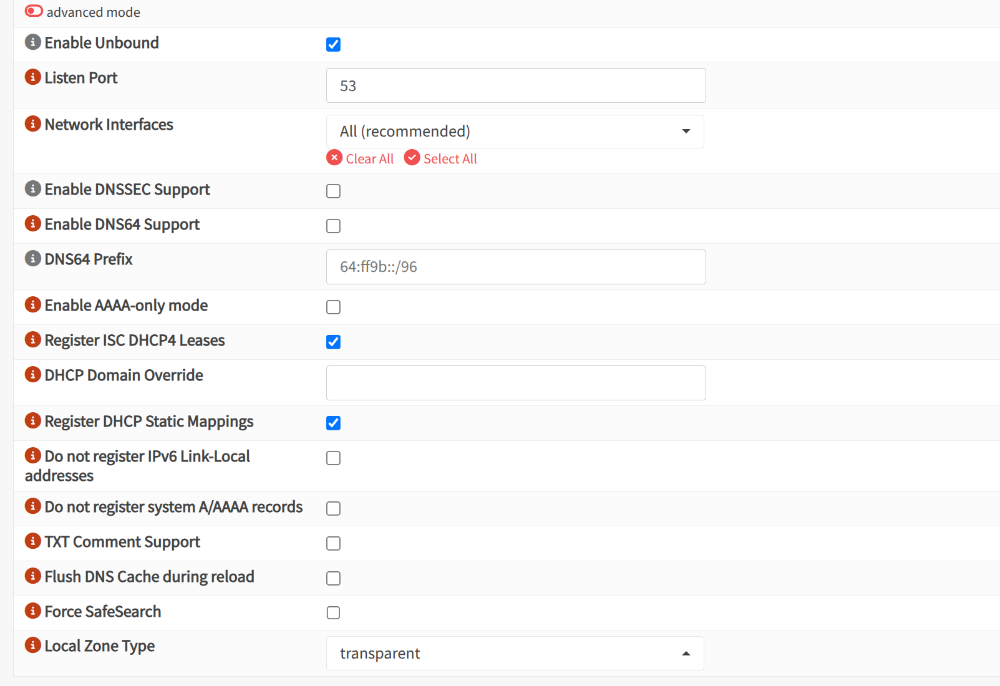

# Creazione container

Per nginx è sufficiente un container, diamogli
- 1 core
- 1 GB RAM
- 8 GB storage
- ip statico nella sottorete dell'homelab (10.0.10.5)

# Modifiche alla rete per DNS

Dobbiamo istruire OPNsense a riconoscere i nomi dei dispositivi locali:

- OPNsense > Services > Unbound DNS > General > abilitiamo la registrazione DHCP
    