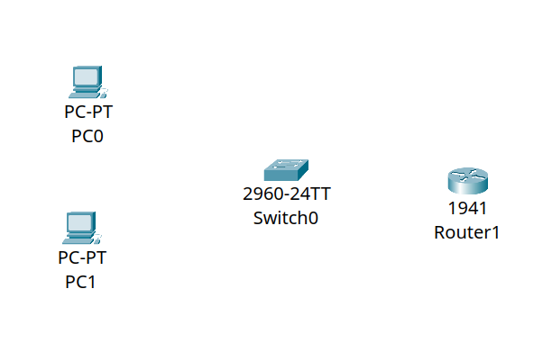
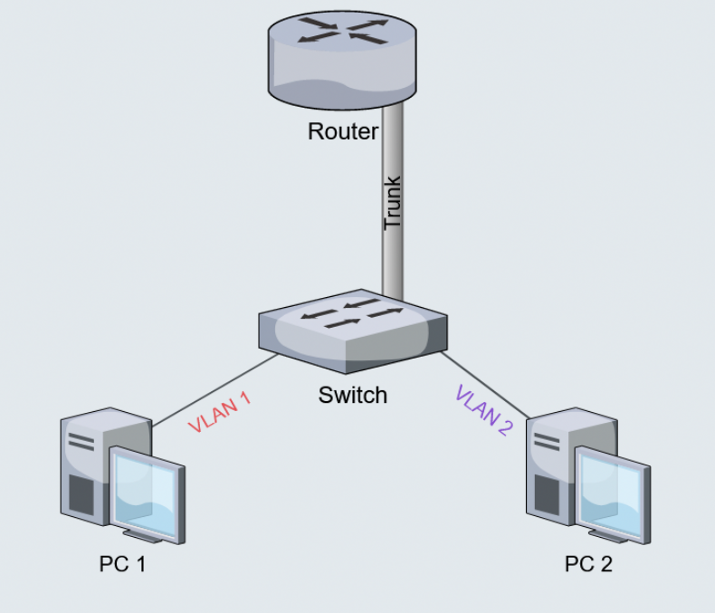
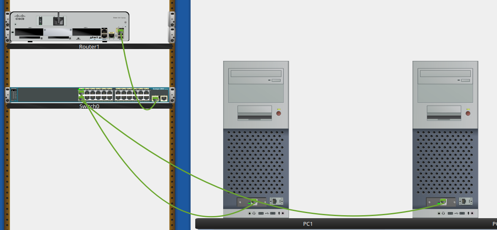
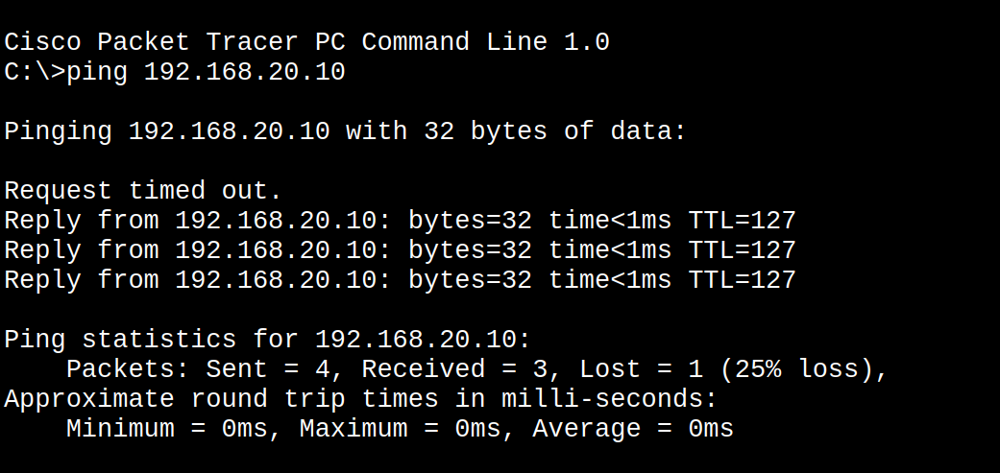
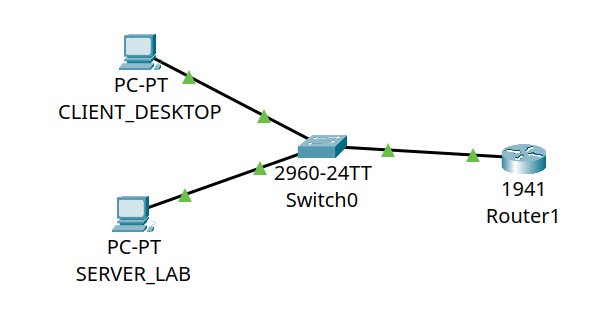

# Overview
In this example I setup a simple network, trying to figure out what i can do before setupping my actual homelab and how to do it virtually with cisco packet tracer.

# Initial Setup
The item i chose were:

{ width="400" }

- Two Pcs
- 2960-24TT switch
- 1941 router
 
I chose those devices becouse they have GigabitEthernet (1 Gbps at least) port by default, instead slower FastEthernet ports (100 Mbps)

With those item we will create a simple network between two machines, which we will divde into two VLANs

- VLAN10: the computer desktop vlan
- VLAN20: the server vlan

We will implement Router on a stick network, also knwon as a one-armed router, a network where the router is connected to multiple VLAN through only one phisical interface thanks to a switch connected with trunk connection.

{ width="400" }

In a LAN network without segmentation all devices are connected and can view each others, so we have to create isolated network using VLANs (one network for the servers, one network for desktop devices and one for IoT devices for example).

The Switch is a layer 2 network device that can separate network into VLANs and the Router is a layer 3 network device that can make communicate VLAN10 with VLAN20.

# CLI Commands

## Base commands

- `enable`: change from user mode (>) to privileged mode (#)
  
- `configure terminal`: enter the global configuration (`(config)#`), now we can configure
  
- `end`: exit the configuration

- `write memory`: move the changement to the volatile RAM to the NVRAM (non volatile) (it saves the modification)

## IOS switch CLI

- `vlan x`: create a vlan identified with the number x
  
- `name y`: assign a textual tag y to the created vlan x

- `interface portName portNumber`: enter into the contest of the pyhisical port

- `switchport mode access`: configure the port to receive data from endpoint devices like PCs and being able to receive data only by one device

- `switchport access vlan x`: insert the port that we are configuring into the vlan x, so the data emitted from the device connected to this port will be labeled with number x

- `switchport mode trunk`: configure the port to receive data from multiple devices labeled with different tags that represent the vlan and the 802.1Q tag

## IOS router CLI

- `no shutdown`: the ports are shutdown di default, so we have to disable this

- `encapsulation dot1Q x`: configure the virtual interface to accept packet from dot1Q standard (802.1Q) labeleb with x number, representing the VLAN

- `ip address x`: assign ip address x to the interface that is being configured, transformed it into the default gateway to all the devices on that sub-network


# Step by step guide

## Connect devices

First, you have to connect devices with the right camble and the right port

We connect PCs with Copper Straight-Through cable to the FastEthernet0 ports of the switch:

- CLIENT_DESKTOP to FastEthernet0/1
- SERVER_LAB to FastEthernet0/2

We connect the switch to router with Copper Straight-Through cable:

- GigabitEthernet0/1 of the siwtch to the GigabitEthernet0/0 of the router.

{ width="800" }

## Configure PCs

We have to assign the network configuration for two PCs, through the ip configuration app

Client desktop:

- IPv4: 192.168.10.10
- Subnet Mask: 255.255.255.0
- Gateway: 192.168.10.1

Server lab:

- IPv4: 192.168.20.10
- Subnet Mask: 255.255.255.0
- Gateway: 192.168.20.1

In this way we orginized the two devices in two different subnet (one on the 10 and one on the 20), and the gateway is conventionally the first device of that network (so .1).

## Configure switch

Now we have to:

- create VLANs
- insert devices into them
- connect the router in trunk mode

```bash

    enable
    configure terminal

    vlan 10
    name CLIENT_DESKTOP
    exit

    vlan 20
    name SERVER_LAB
    exit

    interface fastEthernet 0/1
    switchport mode access
    switchport access vlan 10
    exit

    interface fastEthernet 0/2
    switchport mode access
    switchport access vlan 20
    exit

    interface gigabitEthernet 0/1
    switchport mode trunk
    exit

```

## Configure router

```bash

    enable
    configure terminal

    interface gigabitEthernet 0/0
    no shutdown
    exit

    interface gigabitEthernet 0/0.10
    encapsulation dot1Q 10
    ip address 192.168.10.1 255.255.255.0
    exit

    interface gigabitEthernet 0/0.20
    encapsulation dot1Q 20
    ip address 192.168.20.1 255.255.255.0
    exit

    end
    write memory
```

## Conclusion

Now we can ping the two devices and it should work:

{ width="700" }

and the network are working

{ width="500" }

you can find the working solution on 