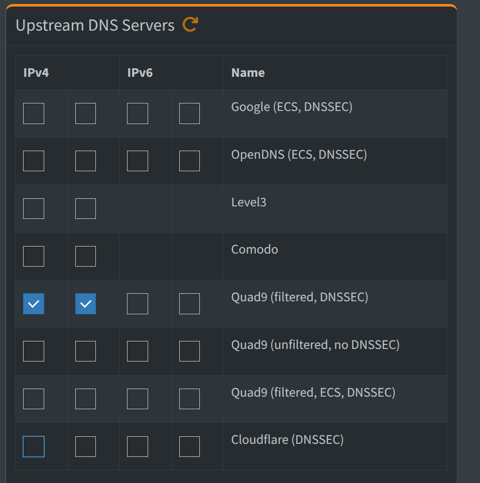
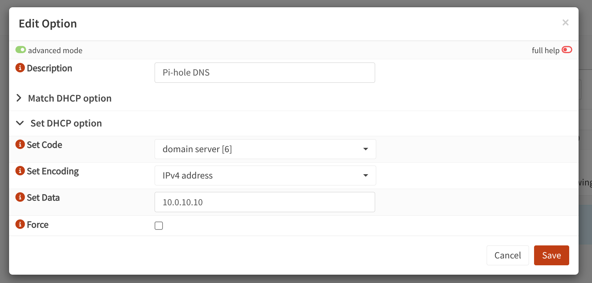
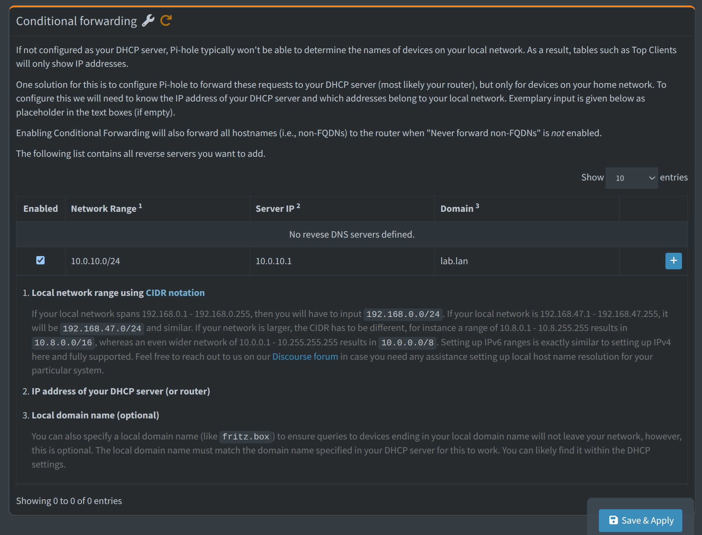

# Installare vm

- os: debian13
- core: 1
- ram: 512MB
- storage: 4GB 
- static ip: 10.0.10.10/24
- gateway: 10.0.10.1

# Installazione pi-hole

1. Aggiornare sistema
    apt update && apt upgrade -y

2. Installare pi-hole
    curl -sSL https://install.pi-hole.net | bash

Procedere con l'installazione

# Configurare

Selezionare Quad9(filtered, DNSSEC) perchè include un filtro anti-malware e anti-phishing.

Aggiornare gravity: mantiene una lista dei siti segnalati come pericolosi, le ultime definizioni di tracker e banner pubblicitari.

Aggiungere su OPNsense il nuovo DNS di pi-hole, in questo modo impongo ai dispositivi connessi alla rete di utilizzare Pi-hole come DNS primario.

## Conditional fowarding

aggiungerte il conditional fowarding per smistare le richieste dei dispositivi connessi alla rete.
Se un dispositivo fa una richiesta normale viene smistato verso Quad9 ed il suo filtro anti-malware.
Se fa una richiesta di tipo x.lab.lan chiedendo una richiesta interna -> dirotta su OPNsense che ha la mappa di rete.

## Aggiungere proxy

Andare su nginx proxy manager e aggiungere un proxy host, scrivendo

- dominio (x.lab.lan)
- indirizzo
- checkare le tre caselle (cache, protezione da exploit...)